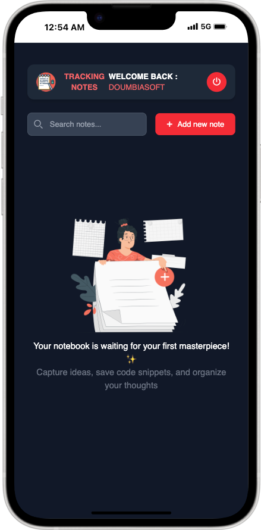

#  Tracking Notes

A secure, feature-rich note-taking Progressive Web Application with code snippet support and syntax highlighting.

|                                   Mobile View                                    |                               Desktop View                                |
| :------------------------------------------------------------------------------: | :-----------------------------------------------------------------------: |
|  |  |

## 🚀 Overview

**Tracking Notes** is a modern web application designed for developers and note-takers who need a secure, organized way to store personal notes with code snippets. Built with vanilla JavaScript and a focus on security, it provides a complete note management solution with user authentication, real-time search, and beautiful syntax highlighting.

## 🌐 Live at: <a href="https://doumbiasoft.github.io/tracking-notes" target="_blank">Try Tracking Notes</a>

## ✨ Key Features

### 🔐 **Secure Authentication System**

- **Registration**: Robust validation with secure password requirements
- **Login/Logout**: Session management with automatic redirection
- **Navigation Protection**: Prevents unauthorized access to protected pages
- **Data Encryption**: Local storage protection with Base64 encoding

### 📚 **Advanced Note Management**

- **Full CRUD Operations**: Create, Read, Update, Delete notes seamlessly
- **Code Snippet Support**: Dedicated code field with syntax highlighting
- **Modal-based Editing**: Smooth, non-intrusive editing experience
- **Delete Confirmation**: Safety modal to prevent accidental deletions
- **Real-time Search**: Instant filtering by title and content

## 🛠️ Technologies Used

- **Frontend**: Vanilla JavaScript (ES6+)
- **Styling**: Tailwind CSS v4, Custom CSS
- **UI Components**: Flowbite (modals and interactions)
- **Code Highlighting**: Highlight.js with GitHub Dark theme
- **Icons**: Font Awesome 7.0.0
- **Storage**: Browser localStorage with encryption
- **PWA**: Web App Manifest for installability

3. **Access the application**
   - Open your browser and navigate to `https://doumbiasoft.github.io/tracking-notes/index.html`
   - Start with registration or use existing credentials

## 📱 Usage Guide

### Getting Started

1. **Register**: Create a new account with secure credentials
2. **Login**: Access your personal note space
3. **Create Notes**: Click "Add new note" to start writing
4. **Add Code**: Include code snippets with syntax highlighting
5. **Search**: Use the search bar to find specific notes instantly

## 🔒 Security Features

### Data Protection

- **Local Storage Encryption**: Base64 encoding for all stored data
- **Input Validation**: Comprehensive form validation with regex patterns
- **Session Management**: Secure user authentication tracking

## 🎯 Key Features in Detail

### Authentication System

- **Registration**: Secure account creation with validation
- **Login**: Credential verification with error handling
- **Session Management**: Encrypted current user storage
- **Auto-redirect**: Smart routing based on authentication

### Note Management

- **Create**: Modal-based note creation with code support
- **Read**: Beautiful display with syntax highlighting
- **Update**: Seamless editing with pre-populated forms
- **Delete**: Confirmation modal for safety
- **Search**: Real-time filtering by title and content

### User Experience

- **Responsive Design**: Works on all device sizes
- **Dark Theme**: Consistent dark UI throughout
- **Loading States**: Visual feedback during operations
- **Error Handling**: Comprehensive validation messages
- **Empty States**: Encouraging messaging when no notes exist

## 🐛 Known Issues & Limitations

- Client-side storage only (no server persistence)
- Single-user per browser session
- Limited to browser storage capacity

## 🤔 Project Reflection

### What could have been done differently during planning?

- **Component Architecture**: Planning a more modular structure with separate classes for Authentication, Notes, and UI management
- **State Management**: Implementing a centralized state system instead of scattered global variables
- **TypeScript Setup**: Using TypeScript from the start for better error catching and code maintainability

### What would be added with more time?

#### Immediate Improvements

- **Real Encryption**: Replace Base64 with proper AES encryption for localStorage
- **Export/Import**: PDF export functionality

#### Long-term Features

- **Backend Integration**: RESTful API with database persistence
- **Enhanced Code Support**: Multiple code blocks per note with execution environment
